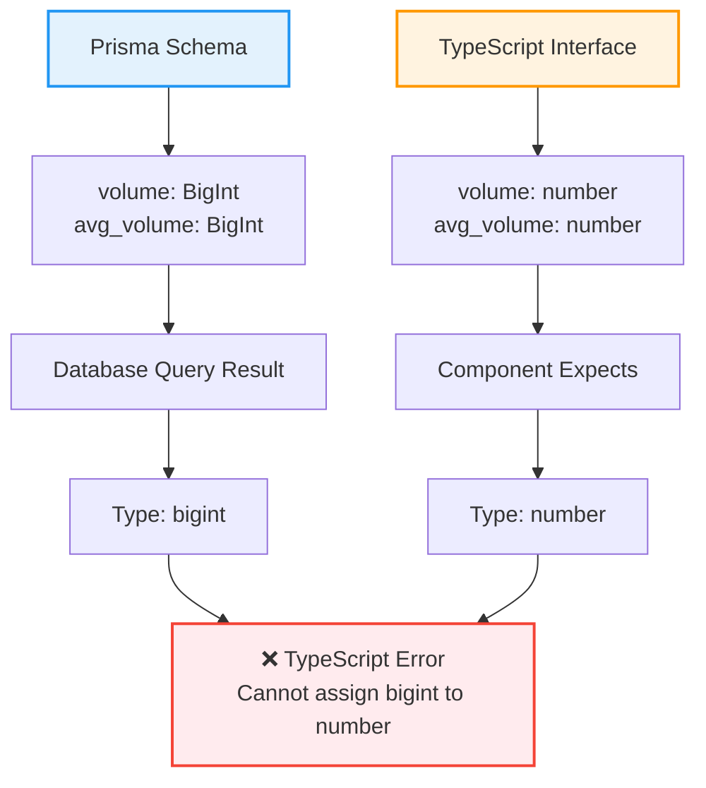

# BigInt Volume Fields Fix Guide

## Issue Summary

The TypeScript error occurs because there's a **type mismatch** between your Prisma schema and the interface definition:

- **Prisma Schema**: `volume` and `avg_volume` are defined as `BigInt` 
- **TypeScript Interface**: They were typed as `number`
- **Result**: TypeScript can't assign the Prisma result (with BigInt) to your interface (expecting number)

## Error Details

```
Argument of type '(sugg: SpreadSuggestion) => JSX.Element' is not assignable to parameter of type...
The types of 'stock_data.volume' are incompatible between these types.
Type 'bigint' is not assignable to type 'number'.
```

## Problem Diagram



## Solution Flow

```mermaid
graph TD
    A[Current State] --> B{Choose Solution}
    
    B --> C[Option 1: Change Schema<br/>Recommended]
    B --> D[Option 2: Handle BigInt<br/>in TypeScript]
    
    C --> E[Update Prisma Schema<br/>BigInt → Float]
    E --> F[Generate Migration<br/>npx prisma migrate dev]
    F --> G[Update Database<br/>ALTER COLUMN TYPE]
    G --> H[Update TypeInterface<br/>bigint → number]
    H --> I[✅ Fixed - No Conversion Needed]
    
    D --> J[Keep Schema as BigInt]
    J --> K[Update TypeScript Interface<br/>number → bigint]
    K --> L[Convert in UI Components<br/>Number(bigintValue)]
    L --> M[✅ Fixed - Manual Conversion]
    
    style I fill:#e8f5e8,stroke:#4caf50,stroke-width:2px
    style M fill:#e8f5e8,stroke:#4caf50,stroke-width:2px
    style C fill:#e3f2fd,stroke:#2196f3,stroke-width:2px
    style D fill:#fff3e0,stroke:#ff9800,stroke-width:2px
```

## How to Fix

### Option 1: Change Database Schema (Recommended)

#### 1. Update Prisma Schema

```prisma
model stock_data {
  symbol                 String  @id
  indicators_symbol      String  
  indicators_timestamp   DateTime
  price                  Float
  change                 Float
  change_percent         Float
  volume                 Float   // ← Changed from BigInt
  avg_volume             Float   // ← Changed from BigInt
  ema_10                 Float
  ema_20                 Float
  sma_50                 Float
  rsi                    Float
  macd                   Float
  macd_signal            Float
  macd_histogram         Float
  bb_upper               Float
  bb_middle              Float
  bb_lower               Float
  stoch_k                Float
  stoch_d                Float
  williams_r             Float
  cci                    Float
  market_bias            String
  bias_strength          Float
  support_levels         Float[]
  resistance_levels      Float[]
  overall_recommendation String
  expected_moves         Float
  last_updated           DateTime
  is_updating            Boolean
  
  // Add this relation
  spread_suggestions     spread_suggestions[]
}
```

#### 2. Generate and Run Migration

```bash
npx prisma migrate dev --name "change_volume_to_float"
```

#### 3. Manual SQL Migration (NeonDB)

If you need to run the SQL manually in NeonDB:

```sql
-- Change volume columns from BigInt to Double Precision (Float)
ALTER TABLE stock_data 
ALTER COLUMN volume TYPE DOUBLE PRECISION,
ALTER COLUMN avg_volume TYPE DOUBLE PRECISION;
```

### Option 2: Handle BigInt in TypeScript (Alternative)

#### Update Interface to Accept BigInt

```typescript
interface StockData {
  symbol: string;
  indicators_symbol: string;
  indicators_timestamp: Date;
  price: number;
  change: number;
  change_percent: number;
  volume: bigint;        // ← Accept BigInt
  avg_volume: bigint;    // ← Accept BigInt
  // ... other fields
}
```

#### Convert BigInt for Display

```typescript
// Convert BigInt to number for calculations
<div>
  <span className="text-gray-500">Volume:</span>
  <span className="ml-1 font-medium text-gray-800">
    {(Number(sugg.stock_data.volume) / 1000000).toFixed(1)}M
  </span>
</div>
```

## Recommendation

**Use Option 1** - Change to `Float` in Prisma schema because:

- ✅ Volume data doesn't need BigInt precision (max safe integer: 9,007,199,254,740,991)
- ✅ Float is more appropriate for financial data
- ✅ Easier to work with in JavaScript/TypeScript
- ✅ Matches typical financial data APIs
- ✅ No conversion needed in UI components
- ✅ Better performance for calculations

## Migration Steps

1. **Backup your data** (recommended for production)
2. **Update the Prisma schema** (`schema.prisma`)
3. **Generate migration**: `npx prisma migrate dev --name "change_volume_to_float"`
4. **Update TypeScript interfaces** (uncomment the volume fields)
5. **Test the application**

## After Migration

Once the migration is complete, you can uncomment the volume-related code in your React component:

```typescript
// Uncomment these lines in the interface
volume: number;
avg_volume: number;

// Uncomment this in the UI
<div>
  <span className="text-gray-500">Volume:</span>
  <span className="ml-1 font-medium text-gray-800">
    {(sugg.stock_data.volume / 1000000).toFixed(1)}M
  </span>
</div>
```

## Notes

- The migration will preserve existing data by converting BigInt values to Float
- Stock volume rarely exceeds JavaScript's safe integer limit
- This change improves type safety and reduces complexity in your application